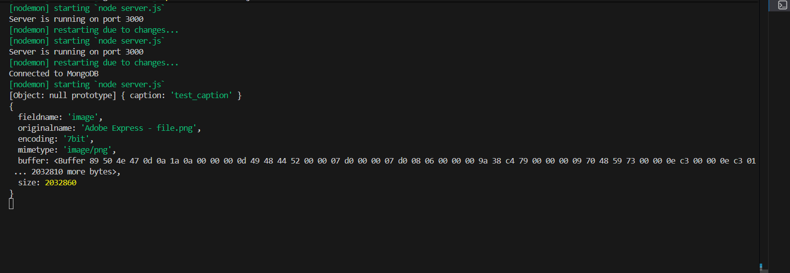

1. Cloud Storage Provider: Company that stores your data online and lets you access it anytime through internet.

2. 
multer: Multer is an Express middleware used to upload and store files from client to server.

npm i multer

3. 
Here 
buffer: is the actual file data.

4. Cloud Storage Provider: Imagekit, Cloudinary, AWS S3

5. For making things credential we use .env files and it is used by command "npm i dotenv".

6. Workflow in industries is firstly backend is going to prepared and then by reading the documentation the frontend person make the ui and excutes the design.

7. "npm i axios" => it helps to get api calls in frontend.

8. CORS Policy: Cross-Origin Resource Sharing (CORS) is a security mechanism implemented by web browsers that allows web applications to make requests to a different domain (origin) than the one that served the web page.  It is designed to protect users from malicious scripts by extending the same-origin policy (SOP), which by default blocks cross-origin requests. 

9. Created an web application :

