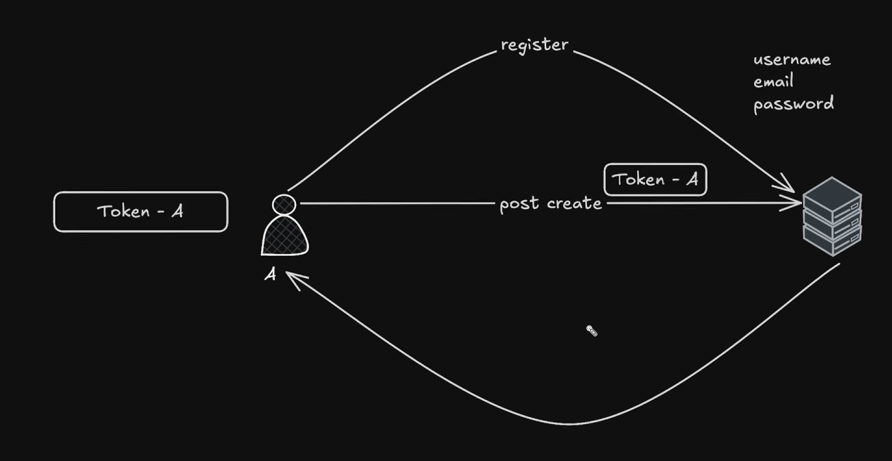

1. There are 4 things in authentication:
=> Validation: inputs of values validations.
=> Verification: is the input of person is correct or not.
=> Authentication:  to identify the request from the person to server.
=> Authorization : the verification of user that what type of work he can do.

For Generating tokens we use "npm i jsonwebtoken"

## 2. Browser Storage Types

### 1. Local Storage
- Stores data permanently (until manually cleared)
- Storage limit: ~5–10MB
- Not sent to the server

### 2. Session Storage
- Stores data until the browser tab is closed
- Storage limit: ~5MB
- Not sent to the server

### 3. Cookies
- Small data storage (~4KB)
- Can have an expiration date
- Sent to the server with every HTTP request
- this storage is having admin storage.
- able to manuplate the data and the stored data.
- 

### 4. IndexedDB
- Large storage capacity
- Stores structured data (objects, files, blobs)
- Used for complex or offline applications

### 5. Cache Storage
- Stores website assets (HTML, CSS, JS, images)
- Used in Progressive Web Apps (PWA) for offline support

3. "npm i cookie-parser" is used for middleware in cookies formation.
